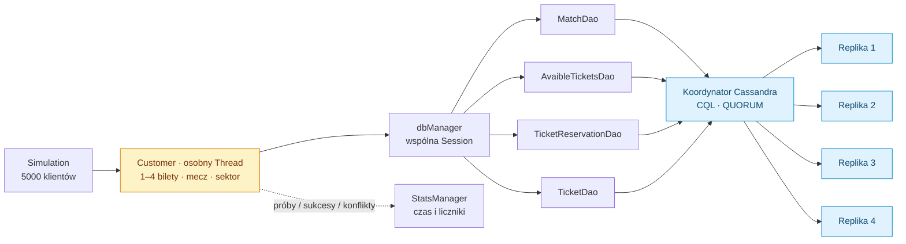
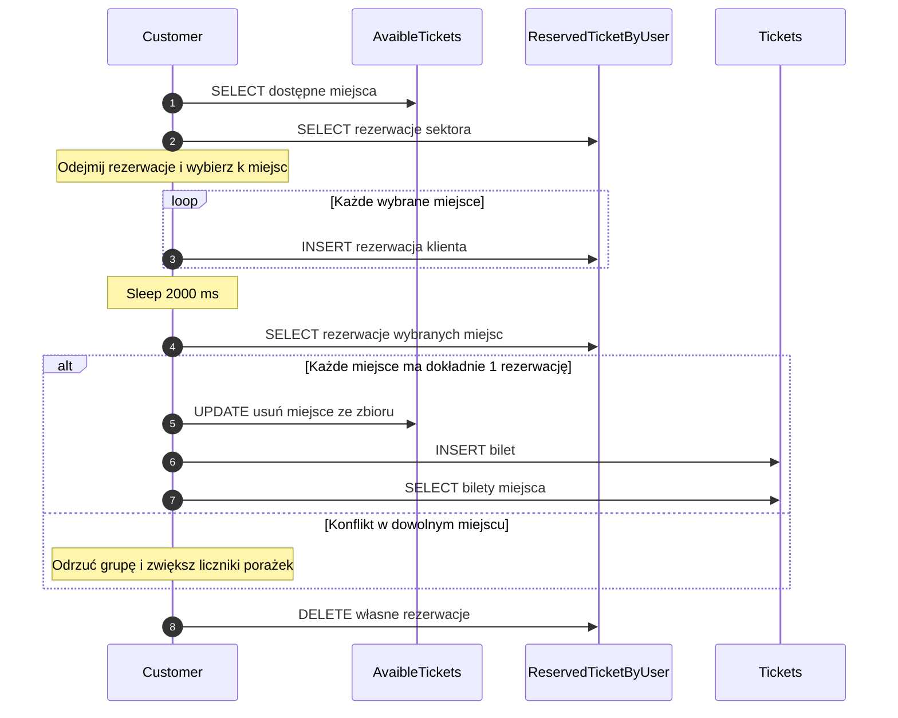

# CassandraStadionTickets

Symulacja współbieżnej rezerwacji i sprzedaży biletów stadionowych w **Javie i Apache Cassandra**. Tysiące klientów odczytują dostępne miejsca, tworzą tymczasowe rezerwacje, wykrywają kolizje i zapisują zakup. Projekt pozwala prześledzić wpływ współbieżności, modelu danych i poziomu spójności na wynik sprzedaży.

To eksperyment z wykrywaniem konfliktów po zapisie. Obecny kod nie zapewnia atomowego przydzielenia miejsca ani transakcyjnego zakupu grupy biletów.

## Spis treści

- [Architektura](#architektura)
- [Model danych](#model-danych)
- [Algorytm rezerwacji](#algorytm-rezerwacji)
- [Spójność i konflikt klientów](#spójność-i-konflikt-klientów)
- [Koszt i statystyki](#koszt-i-statystyki)
- [Uruchomienie](#uruchomienie)
- [Ograniczenia](#ograniczenia)

## Architektura



Cztery repliki odpowiadają konfiguracji `srds-cassandra.yaml` i domyślnemu RF=4 w `CassandraConnector`. Jeśli keyspace już istnieje, connector nie zmienia jego współczynnika replikacji.

| Plik / katalog | Rola |
| --- | --- |
| `src/main/java/Customer.java` | Cały przebieg pojedynczego klienta. |
| `CassandraConnector.java` | Połączenie, domyślna spójność zapytań i utworzenie keyspace. |
| `dbManager.java` | Zestaw DAO korzystających z jednej sesji. |
| `Dao/` | Zapytania CQL i obiekty danych. |
| `Logs/StatsManager.java` | Liczniki operacji i pomiar czasu. |
| `src/test/java/createTables.java` | Usuwanie i odtwarzanie tabel oraz przykładowych miejsc. |
| `src/test/java/Simulation.java` | Program symulacji; metoda `main`, bez asercji JUnit. |
| `srds-cassandra.yaml` | StatefulSet czterech instancji i headless Service. |
| `schema.cql` | Alternatywny, niespójny z kodem szkic schematu. |

## Model danych

Źródłem poniższego opisu są polecenia w `Dao/CassandraTable.java`.

| Tabela | Klucz partycji | Kolumny klastrowania | Przeznaczenie |
| --- | --- | --- | --- |
| `Matches` | `matchid` | — | Opis meczu. |
| `Tickets` | `matchid` | `sector`, `place`, `userid` | Sprzedane bilety i dane klienta. |
| `ReservedTicketByUser` | `(matchid, sector)` | `place`, `userid` | Rezerwacje miejsca, także równoległe rezerwacje różnych użytkowników. |
| `AvaibleTickets` | `matchid` | `sector` | Zbiór `placeList set<int>` dostępnych miejsc sektora. |

Klucz partycji określa grupę danych obsługiwaną wspólnie przez bazę. Kolumny klastrowania rozróżniają i porządkują wiersze wewnątrz tej grupy. Rezerwacje są modelowane pod odczyt „mecz + sektor + opcjonalnie miejsce”, mimo nazwy sugerującej odczyt po użytkowniku.

**Ważna konsekwencja klucza:** `(mecz=1, sektor=A, miejsce=10, użytkownik=X)` i ten sam fotel dla użytkownika `Y` są różnymi wierszami zarówno rezerwacji, jak i sprzedaży. Klucz nie narzuca wyłączności fotela. Kilka osób może mieć zapis dla tego samego miejsca.

## Algorytm rezerwacji

### 1. Odczyt i wybór miejsc

`Customer.run()` zaczyna od losowego opóźnienia poniżej 3000 ms. Następnie pobiera dostępne miejsca oraz rezerwacje sektora i wykonuje lokalne `removeAll(currentReserved)`.

Jeżeli pozostało mniej miejsc niż `ticketsCount`, klient kończy operację i zwiększa licznik braków. W przeciwnym razie losuje miejsce z bieżącej listy, zapisuje rezerwację i usuwa je z tej listy. Dzięki usuwaniu jeden klient nie wybiera tego samego fotela dwa razy w ramach jednej próby.

### 2. Zapis zamiaru i okno konfliktu

Dla każdego wybranego miejsca wykonywany jest zwykły `INSERT` do `ReservedTicketByUser`. Wszystkie miejsca klienta otrzymują ten sam wygenerowany `ticketid`; identyfikacja wiersza nadal wynika z klucza tabeli.

Klient śpi 2000 ms. Ten czas tworzy okno, w którym inni klienci mogą dopisać swoje rezerwacje. Nie jest to blokada, TTL ani gwarancja, że wszystkie konkurencyjne operacje już się zakończyły.

### 3. Kontrola całej grupy

Po opóźnieniu klient odczytuje rezerwacje każdego planowanego fotela. Warunek powodzenia to **dokładnie jeden wiersz dla każdego miejsca**:

```text
success := true
for place in plannedReservedPlaces:
    if liczba_rezerwacji(mecz, sektor, place) != 1:
        success := false
        przerwij sprawdzanie
```

Jedna kolizja odrzuca całą grupę na poziomie decyzji aplikacji. Kod nie wybiera zwycięzcy konfliktu i nie podejmuje kolejnej próby. `reservationRetries` liczy próby miejsc, mimo nazwy sugerującej automatyczne ponawianie.

### 4. Sprzedaż i sprzątanie

Przy sukcesie dla każdego miejsca wykonywane są osobno:

1. Usunięcie miejsca ze zbioru dostępnych foteli.
2. Zapis biletu z danymi klienta.
3. Odczyt biletów dla miejsca, używany do zwiększenia statystyki sukcesu.
4. Usunięcie własnej rezerwacji.

Przy konflikcie kod zwiększa licznik porażek i usuwa własne rezerwacje. Brak transakcji obejmującej wszystkie kroki: awaria w połowie może pozostawić niespójny stan albo częściowy zakup.



## Spójność i konflikt klientów

`Simulation` ustawia `ConsistencyLevel.QUORUM`. Dla RF=4 quorum wynosi `floor(4/2)+1 = 3`. Poziom określa liczbę odpowiedzi replik potrzebną dla danej operacji; nie zmienia kilku zapytań aplikacji w jedną transakcję. Przecinanie quorum odczytu i zapisu oraz osobny mechanizm compare-and-set opisują [architektura Cassandra](https://cassandra.apache.org/doc/latest/cassandra/architecture/dynamo.html) i [gwarancje LWT](https://cassandra.apache.org/doc/stable/cassandra/architecture/guarantees.html).

Przykład luki czasowej, możliwy również przy prawidłowo dostarczanych zapytaniach:

| Krok | Klient A | Klient B |
| --- | --- | --- |
| 1 | Odczytuje fotel jako dostępny. | Odczytuje ten sam fotel jako dostępny. |
| 2 | Zapisuje rezerwację i odczekuje. | Jest opóźniony przed zapisem rezerwacji. |
| 3 | Widzi jedną rezerwację, sprzedaje bilet i usuwa rezerwację. | Nadal ma wcześniej odczytaną listę. |
| 4 | Zakup zakończony. | Zapisuje własną rezerwację, widzi tylko siebie i również sprzedaje bilet. |

Problemem jest rozdzielenie sprawdzenia i zapisu. Aktualny kod nie wykonuje `IF NOT EXISTS` ani warunkowej zmiany stanu pojedynczego fotela.

Dla atomowej rezerwacji potrzebny byłby rekord o kluczu identyfikującym **miejsce**, z warunkowym przejściem ze stanu wolnego do zarezerwowanego. LWT w Cassandra używa Paxosa do compare-and-set. Taki mechanizm nie jest zaimplementowany tutaj; nie rozwiązuje też sam z siebie transakcji na dowolnej grupie miejsc. [Dokumentacja Cassandra](https://cassandra.apache.org/doc/stable/cassandra/architecture/guarantees.html).

## Koszt i statystyki

Symulacja tworzy 5000 obiektów klientów i 5000 osobnych wątków. Każdy kupuje losowo 1–4 miejsca dla jednego z sześciu meczów i sektora A–D. Dane startowe obejmują `6 × 4 × 50 = 1200` miejsc.

Dla udanego klienta kupującego `k` miejsc typowy przebieg wykonuje `2 + 6k` zapytań: dwa odczyty początkowe, `k` rezerwacji, `k` kontroli konfliktu i cztery operacje na każdy sprzedawany fotel. Przy konflikcie liczba kontroli zależy od momentu przerwania pętli.

Odczyt wszystkich rezerwacji sektora i lokalne odejmowanie rosną z liczbą rezerwacji. Zwiększanie liczby wątków może obciążyć połączenia i bazę, zamiast zwiększyć przepustowość.

Statystyki dotyczą przede wszystkim **miejsc**, nie zakończonych klientów. „Sukces” jest naliczany, jeśli istnieje jakikolwiek bilet dla miejsca; ten odczyt nie weryfikuje właściciela ani braku duplikatów. Czas obejmuje uruchamianie klientów, ich opóźnienia oraz zapytania do bazy.

## Uruchomienie

Wymagane są JDK obsługujący ustawiony w `pom.xml` poziom Java 13, Maven i dostępny klaster Cassandra. Projekt używa sterownika DataStax 3.6.0; adres, port `9042`, keyspace `srds` i spójność są zapisane w kodzie.

Kompilacja kodu głównego i klas symulacji:

```bash
mvn test-compile
```

`mvn test` nie uruchamia automatycznie `main()` symulacji. W IDE należy uruchomić kolejno klasy `createTables` i `Simulation`, z classpathem testowym i zależnościami Maven.

**`createTables` usuwa istniejące cztery tabele przed utworzeniem danych startowych. Uruchamiaj ją wyłącznie na bazie przeznaczonej do tego eksperymentu.**

Opcjonalny klaster testowy w Kubernetes można przygotować z manifestu repozytorium:

```bash
kubectl apply -f srds-cassandra.yaml
kubectl get pods -l app=srds-cassandra
kubectl port-forward pod/srds-cassandra-0 9042:9042
```

Przekierowanie portu udostępnia punkt kontaktowy, ale sterownik odkrywa także adresy innych replik. Jeśli nie są osiągalne z maszyny klienta, trzeba dostosować topologię połączenia lub uruchomić klienta w sieci klastra.

## Ograniczenia

| Obszar | Stan kodu |
| --- | --- |
| Schemat | `schema.cql` deklaruje `list<int>`, a Java tworzy i odczytuje `set<int>`. Connector tworzy RF=4, plik CQL RF=5. Nie mieszaj tych konfiguracji. |
| Zapytania kolekcji | `decrese()` używa składni zbioru `{...}`, ale `increase()` listy `[...]`; wymaga ujednolicenia z typem kolumny. |
| Inicjalizacja CQL | `schema.cql` ma `INSERT` przed tworzeniem tabel; nie jest gotowym skryptem bootstrapu. |
| Wyłączność i zakup grupy | Brak LWT, transakcji grupowej i kontroli unikatowości miejsca bez `userid`. |
| Rezerwacje po awarii | Brak TTL i sprzątania w `finally`; przerwana operacja może pozostawić rezerwację. |
| Statystyki | Metody inkrementacji są `synchronized`, ale leniwa inicjalizacja singletonu nie jest zsynchronizowana. |
| Trwałość klastra | PVC jest montowany pod `/var/lib/srds-cassandra/data`, nie pod zwykłym katalogiem danych obrazu Cassandra. Manifest nie ustawia nowej ścieżki danych. |
| Zależności | Lombok `RELEASE` i powtórzony wpis nie zapewniają powtarzalnej konfiguracji budowania. |

Ocena poprawności wymaga sprawdzenia unikatowości `(matchid, sector, place)`, zgodności sprzedanych i dostępnych miejsc oraz zachowania po przerwaniu klienta. Same liczniki sukcesów nie stanowią takiej weryfikacji.
